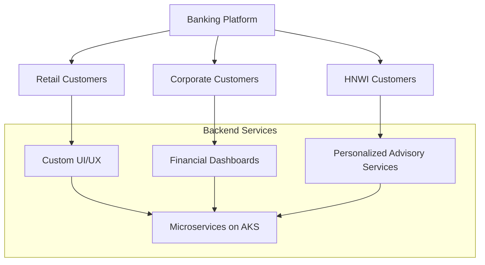
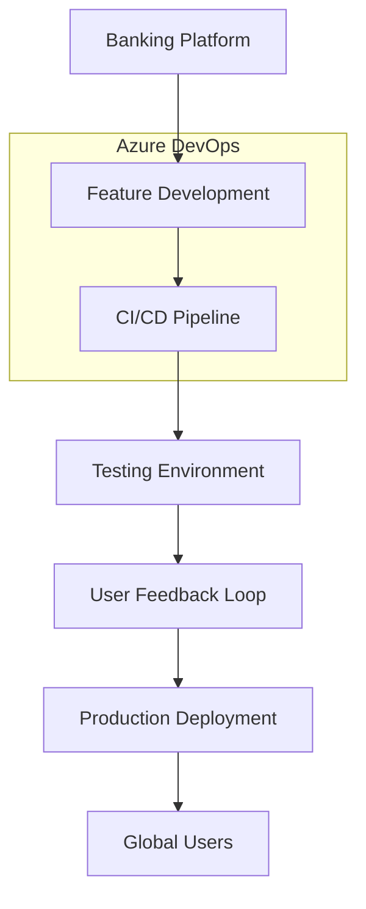
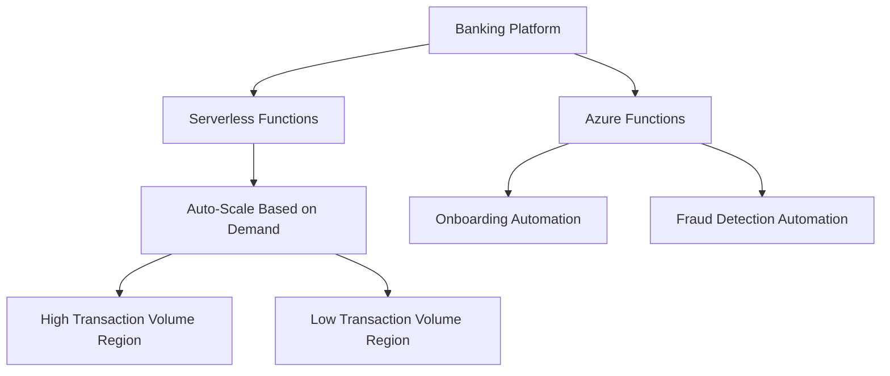
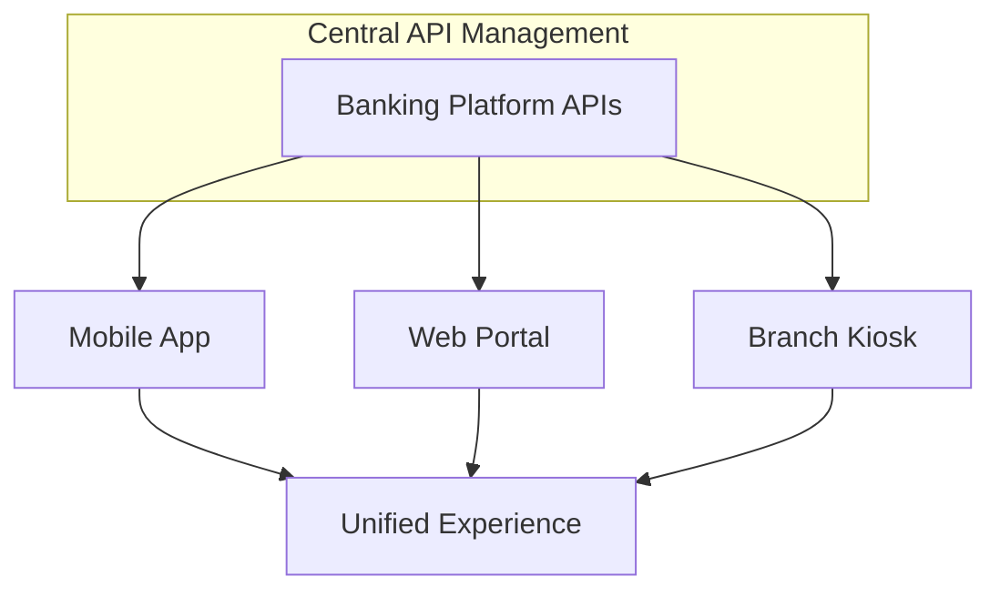
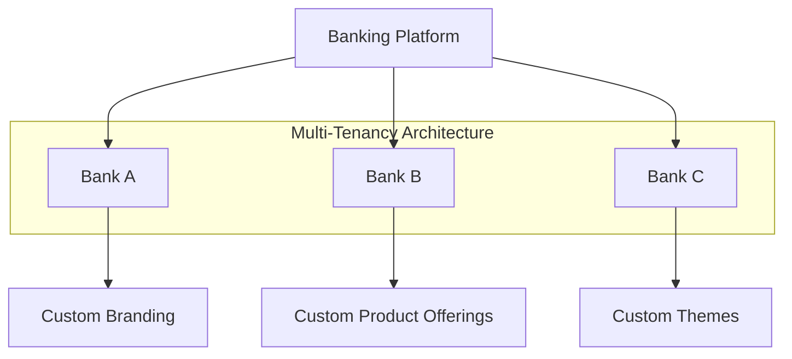
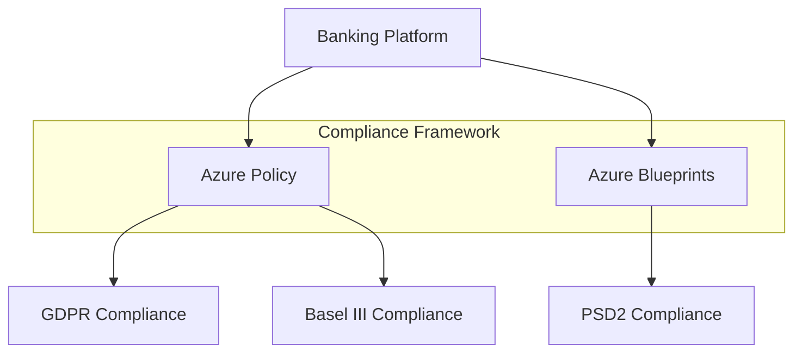
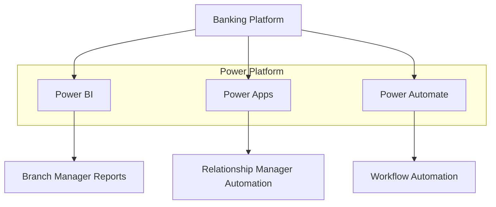
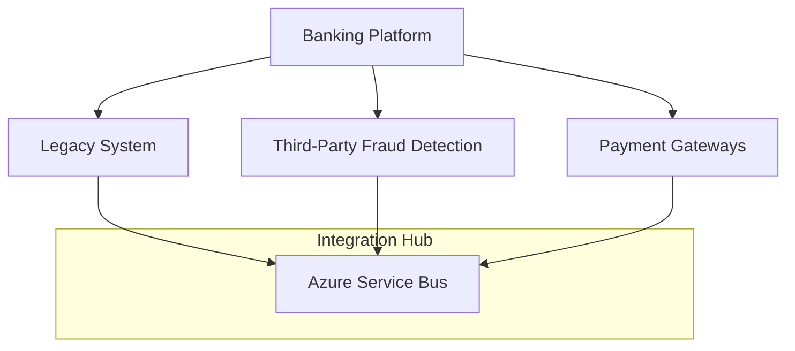

# Digital-Banking-Solution-In-Azure

### Use Cases for the Digital Banking Platform

#### 1. **Rapid Customization for Diverse Customers**

**Use Case**:  
A global bank serves different customer segments: retail customers, corporate clients, and high-net-worth individuals (HNWIs). Each segment has unique needs. Retail customers demand easy-to-use mobile apps, corporate clients need advanced financial reporting, and HNWIs expect personalized services like investment advice and portfolio tracking.

**Solution**:  
The platform provides a multi-tenant architecture with dynamic customization capabilities:
- Retail customers can choose different themes, languages, and user interfaces based on their preferences.
- Corporate clients have access to financial dashboards with real-time reporting and cash management tools tailored to their business needs.
- HNWIs get personalized advisory services through AI-driven analytics that analyze their portfolio and provide recommendations.

The customization is managed by a microservices architecture hosted on Azure Kubernetes Service (AKS), where each service handles specific aspects like transaction history, reporting, or account management. The system can quickly adapt to new customer requirements without affecting the core platform.

#### 2. **Agile Development and Iteration**

**Use Case**:  
The bank needs to roll out new features like peer-to-peer payments, enhanced fraud detection, or regulatory changes (e.g., PSD2 compliance) across different regions.

**Solution**:  
Using Azure DevOps, the bank implements continuous integration and continuous delivery (CI/CD) pipelines, allowing the development teams to push updates frequently. The agile methodology facilitates bi-weekly sprints, enabling the team to prioritize user feedback and regulatory changes. DevOps pipelines enable safe and efficient code deployment to production with automated testing.

For example, if a new compliance rule needs to be implemented (such as GDPR for European customers), it can be integrated and tested in a sandbox environment before being deployed globally.

#### 3. **Reduced Development Costs**

**Use Case**:  
The bank operates in multiple countries, each with varying transaction volumes. Some countries experience high traffic during business hours, while others have a more even distribution of transactions.

**Solution**:  
By utilizing Azure Functions, the bank can leverage serverless computing to scale specific functions like account balance retrieval or transaction verification based on demand. During high transaction periods, Azure auto-scales to accommodate traffic. For lower traffic regions, the bank can reduce resource usage, thereby reducing operational costs.

For example, Azure Functions are used to automate customer onboarding for smaller regions where manual processes would have been expensive and time-consuming.

#### 4. **Consistent Product Experience**

**Use Case**:  
Customers expect a seamless and uniform experience whether they are interacting through a mobile app, web portal, or in-branch kiosk.

**Solution**:  
The platform ensures consistency across channels by using a centralized API management layer via Azure API Management. Every touchpoint (mobile, web, or kiosk) retrieves data from the same set of APIs, ensuring that customers see the same account information, transaction details, and personalized offers, regardless of how they access their banking services.

For example, if a customer initiates a loan application through the mobile app, they can walk into a branch and the banker will have access to the same information, facilitating a smooth customer experience.

#### 5. **Scalability and Multi-Tenancy**

**Use Case**:  
The bank serves millions of customers across several countries, with different banks under its umbrella. Each bank operates under unique branding, but all need to share the same backend infrastructure.

**Solution**:  
The platform uses a multi-tenant architecture that allows multiple banks to share the same infrastructure but maintain isolated customer data. Each tenant can customize the front-end experience and services, while Azure’s Virtual Network (VNet) and Azure AD B2C ensure proper segmentation and security between tenants.

For example, the bank’s UK branch can offer a specialized investment product while the US branch focuses on offering credit cards. Both branches use the same core banking system but present different services and branding to their customers.

#### 6. **Adapting to Regulatory Compliance**

### Use Case: **Rapid Digital Banking Platform for a Global Bank**

The bank needs to address a wide range of customer needs, from retail banking users to corporate clients. It must ensure rapid customization of products and services, while simultaneously providing an agile development process that can evolve as customer demands shift. Leveraging Azure Cloud technologies such as Azure Kubernetes Service (AKS), Azure Logic Apps, and Azure Functions, the platform provides scalability and flexibility.

Additionally, the solution offers a multi-tenant environment where each region can have its own customized experience, all while maintaining regulatory compliance. Non-technical staff are empowered with low-code/no-code tools like Microsoft Power Apps and Power BI to reduce reliance on IT for small customizations and reporting.

By integrating with legacy systems and new third-party solutions via standardized APIs, the platform ensures interoperability, making it easier to provide a consistent and seamless customer experience across channels. The platform is designed to be highly scalable, with the ability to manage millions of users across multiple regions.

**Use Case**:  
The bank operates in multiple regions, each with its own regulatory requirements, such as GDPR in Europe, CCPA in California, and Basel III for financial stability.

**Solution**:  
Azure Policy and Blueprints allow the platform to enforce region-specific regulatory compliance by automatically applying governance policies across resources. This ensures that data residency, encryption, and audit policies are aligned with local regulations without requiring manual intervention.

For instance, the platform uses Azure Key Vault for encryption and auditing, ensuring that only authorized personnel can access sensitive financial data. This setup is adaptable to comply with new regulatory frameworks as they emerge, providing a future-proof compliance strategy.

#### 7. **Empowering Non-Technical Users**

**Use Case**:  
The bank’s relationship managers and branch managers need to generate customized reports and analytics for their regions, but they lack advanced technical skills to build queries or write code.

**Solution**:  
Microsoft Power Platform (Power BI, Power Apps, Power Automate) is integrated into the platform to empower non-technical users. Relationship managers can build their own reports in Power BI by selecting data points such as customer demographics, transaction history, or loan performance. They can automate workflows using Power Automate, for instance, to notify customers about promotions or send reminders for loan payments.

For example, a branch manager in Asia can create a custom dashboard that shows the number of loan applications received each week, without needing IT support, and make data-driven decisions accordingly.

#### 8. **Integration and Interoperability**

**Use Case**:  
The bank has an existing legacy core banking system that handles all customer accounts and transactions. The bank also wants to integrate with third-party FinTech services, such as payment gateways, fraud detection platforms, and loyalty programs.

**Solution**:  
Azure Logic Apps and Azure Service Bus are used to integrate the new platform with the bank’s legacy systems and third-party applications. Logic Apps provide connectors for common banking services and APIs, while Service Bus ensures secure and reliable message delivery between different services.

For example, the bank integrates with a third-party fraud detection service via APIs using Azure API Management and Logic Apps. Transactions above a certain threshold are automatically sent to the fraud detection service, which returns a risk score, helping the bank decide whether to approve or decline the transaction in real-time.

---

### Summary Table

| **Category**                        | **Expanded Use Case**                                                                                                                                                                                                                                                   |
|-------------------------------------|-------------------------------------------------------------------------------------------------------------------------------------------------------------------------------------------------------------------------------------------------------------------------|
| **Rapid Customization for Diverse Customers** | Customizing experiences for retail, corporate, and HNWI customers using dynamic user interfaces, dashboards, and AI-powered personalization.                                                                                                                              |
| **Agile Development and Iteration** | Using Azure DevOps to rapidly iterate and deploy features like peer-to-peer payments and regulatory changes with automated CI/CD pipelines.                                                                                                                                |
| **Reduced Development Costs**       | Leveraging serverless compute (Azure Functions) to scale resources dynamically based on transaction volumes, reducing infrastructure costs.                                                                                                                                |
| **Consistent Product Experience**   | Ensuring a seamless banking experience across all channels (web, mobile, branch kiosks) by using Azure API Management for centralized API access.                                                                                                                         |
| **Scalability and Multi-Tenancy**   | Providing multi-tenant support to allow multiple banks or regions to operate independently, while using shared infrastructure with secure data segregation using Azure VNets and Azure AD B2C.                                                                              |
| **Adapting to Regulatory Compliance**| Using Azure Policy and Blueprints to enforce region-specific regulations like GDPR and Basel III, ensuring compliance across geographies with automated governance policies.                                                                                               |
| **Empowering Non-Technical Users**  | Enabling branch and relationship managers to generate reports and automate workflows using Power BI and Power Automate, reducing reliance on technical teams.                                                                                                             |
| **Integration and Interoperability**| Integrating legacy systems and third-party FinTech services (fraud detection, payment gateways) using Azure Logic Apps and Service Bus to ensure smooth data flow and interoperability.                                                                                      |

Here are **Mermaid diagrams** to represent each of the use cases described in the table. Each diagram is aligned with its corresponding use case to visually explain the flow of information and architecture.

### 1. **Rapid Customization for Diverse Customers**

### 2. **Agile Development and Iteration**

### 3. **Reduced Development Costs**

### 4. **Consistent Product Experience**

### 5. **Scalability and Multi-Tenancy**

### 6. **Adapting to Regulatory Compliance**

### 7. **Empowering Non-Technical Users**

### 8. **Integration and Interoperability**

Each of these Mermaid diagrams represents the architecture or workflow related to the banking platform and the specific use case. These diagrams can help in visually understanding how each component interacts with others, providing a clear picture of how the system functions in real-world scenarios.
